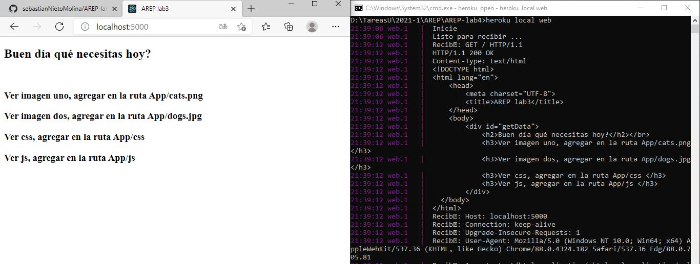

## _Despliegue en Heroku_ 
[](https://lab4arepsebasnieto.herokuapp.com/)

# TALLER DE ARQUITECTURAS DE SERVIDORES DE APLICACIONES, META PROTOCOLOS DE OBJETOS, PATRÓN IOC, REFLEXIÓN

Este proyecto busca implementar un framwork parecido a Srping-Boot, al igual que Spring debe leer la petición get por medio de etiquetas @RequestMapping. Su alcance es explorar la arquitectura de sistemas distribuidos en la red, tiene como objetivo construir un modelo cliente servidor para hacer peticiones http, se debe poder desplegar en heroku, está construido con el patrón de diseño IOC y hace uso de POJO, de igual modo puede tener información mas detallada de la arquitectura y la terminologia en el pdf de [Design.pdf](Design.pdf)

## Comenzando 🚀 

_Estas instrucciones te permitirán obtener una copia del proyecto en funcionamiento en tu máquina local para propósitos de desarrollo._

### Pre-requisitos 📋 

Para poder hacer uso de este proyecto se debe tener instalado:
 
  * MVN
  * Git
  * Java 11
  * HerokuCli (En caso de querer desplegar el proyecto localmente)

### Instalación 🔧 

Lo primero que debe hacer es descargar el proyecto, lo pude hacer directamente descargando el .zip, o puede clonar el archivo con el siguiente comando.

```
git clone https://github.com/sebastianNietoMolina/AREP-lab4.git
```

Entramos al directorio del proyecto con el comando

```
cd AREP-lab4
```

Luego debe ingresar el siguiente comando para que se ejectue hasta la fase de empaquetamiento, debe asegurar que antes de ingresar este comando, que exista en la carpeta que esta un archivo llamado pom.xml

```
mvn clean install package
```

Tambien me gustaria aclarar que puedes descargar el javaDoc, este quedara guardado en una carpeta target, esta se genera una vez echo el comando anterior, y con el siguiente comando se creara la carpeta site, la ruta sera target/site.

```
mvn javadoc:javadoc
```

Si desea correr heroku localmente, hay un archivo que se llama Procfile, si su sistema operativo es Linux, use el siguiente comando.

```
web: java $JAVA_OPTS -cp target/classes edu.escuelaing.arep.app.myspring.AnotherSpring  edu.escuelaing.arep.app.myspring.App
```

Si falla agrega lo siguiente

```
web: java $JAVA_OPTS -cp "target/classes" edu.escuelaing.arep.app.myspring.AnotherSpring  edu.escuelaing.arep.app.myspring.App
```
Si usa windows use el siguiente.

```
web: java -cp target/classes edu.escuelaing.arep.app.myspring.AnotherSpring  edu.escuelaing.arep.app.myspring.App
```

Recuerde que para ver heroku localmente debe ingresar el siguiente comando en cmd 

```
heroku local web
```
Posteriormente debe escribir el siguiente link en su buscador: localhost:5000



Si por el contrario solo ejecuto el programa desde el main, o por comando, debe escribir el siguiente link en su buscador: localhost:36000
Este seria el comando para ejectuarlo por consola.
```
java -cp target/classes edu.escuelaing.arep.app.myspring.AnotherSpring  edu.escuelaing.arep.app.myspring.App
```


## Autores ✒️

_Menciona a todos aquellos que ayudaron a levantar el proyecto desde sus inicios_

* **Sebastian Nieto** - [sebastianNieto](https://github.com/sebastianNietoMolina)

## Licencia 📄 

Este proyecto está bajo la Licencia MIT - mira el archivo [LICENSE.md](LICENSE.md) para detalles

## Expresiones de Gratitud 🎁 

Reconocimientos a: [Villanuevand](https://github.com/Villanuevand), use su plantilla de README.md.
